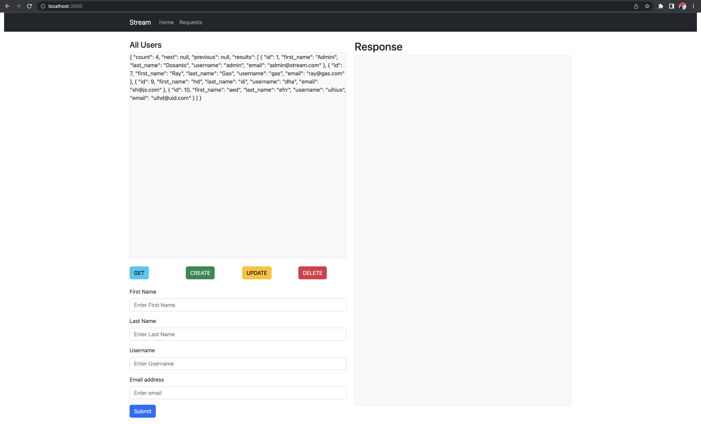

# Backend Setup Instructions

## Navigate to application
```
cd stream
```

## Create a virtual environment and activate it
```
python3 -m venv venv
source venv/bin/activate
```

## Install Python dependencies
```
pip install -r requirements.txt
```


## Run Migrations
```
python manage.py migrate
```

## Start the backend server
```
python manage.py runserver
```

## Optional Create Superuser if you need one 
```
python manage.py createsuperuser --email admin@stream.com --username admin
```


# Frontend Setup Instructions
Install the `npm` application

## Navigate to the frontend folder
```
cd frontend
```

## In the project directory, you can run:
```
npm install
npm start
```

Runs the app in the development mode.\
Open [http://localhost:3000](http://localhost:3000) to view it in your browser.

## Proof



# The Code Assignment


